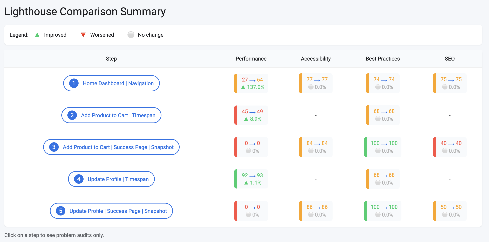
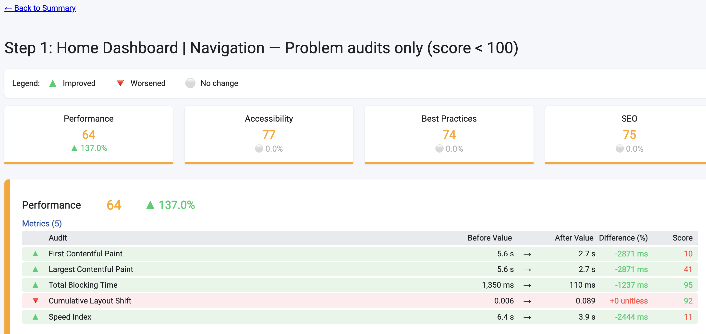

# @thecollege/playwright-lighthouse-flow

This utility enables integration of [Google Lighthouse](https://github.com/GoogleChrome/lighthouse) — using its **Flow Mode** — with [Playwright](https://playwright.dev/). It helps generate performance reports during your end-to-end testing flows with minimal effort.

## Features

- Use Lighthouse Flow API with Playwright's Chromium context.
- Automatically launches a persistent browser with a remote debugging port.
- Authenticated flows supported via custom login functions.
- Generates `.html` and `.json` Lighthouse reports per test.
- Output organized by test name and timestamp.
- Compare Flow Results to see Diffs between executions

---

---

# How @thecollege/playwright-lighthouse-flow Enables Using Lighthouse Flow Mode with Playwright

The package `@thecollege/playwright-lighthouse-flow` bridges Playwright’s browser automation with Lighthouse’s **Flow Mode**, allowing you to run multi-step performance audits on real user flows. Here’s how it works:

---

## Key Mechanisms

### 1. Reusing the Same Browser Instance with Remote Debugging

- Lighthouse Flow Mode requires connecting to a Chromium browser via the Chrome DevTools Protocol (CDP) to gather detailed metrics across multiple user interactions.
- The package launches Chromium through Playwright **with remote debugging enabled** on a dynamic port.
- This setup lets Lighthouse connect to the **same browser session** Playwright controls, preserving authentication, cookies, and page state across steps.

### 2. Coordinating Playwright Actions with Lighthouse Flow Steps

- The package exposes helpers to create and manage Lighthouse **User Flows** (`startFlow`), which represent sequences of user interactions.
- You can define steps such as:
  - **Navigation** (page loads)
  - **Timespan** (periods of user activity)
  - **Snapshot** (point-in-time captures)
- These steps wrap Playwright actions, ensuring Lighthouse collects performance data exactly during your scripted interactions.

### 3. Handling Authentication and Complex User Journeys

- Since Playwright controls the browser context, you can perform login and setup steps **before** starting the Lighthouse flow.
- This enables auditing authenticated pages and complex flows that Lighthouse alone cannot handle.

### 4. Generating Detailed Reports and Assertions

- The package automates generating `.html` and `.json` Lighthouse reports per flow, organized by test name and timestamp.
- It provides utilities to assert Lighthouse category scores at each step, supporting automated performance regression testing.

### 5. Abstracting Chrome DevTools Protocol (CDP) Session Management

- Internally, Puppeteer connects Lighthouse to the Playwright-controlled browser via the remote debugging port.
- This abstracts away the complexity of managing CDP sessions, ensuring seamless integration even as Playwright and Lighthouse evolve.

---

## Summary

| Feature                          | Description                                                                                     |
|---------------------------------|-------------------------------------------------------------------------------------------------|
| **Remote debugging port**        | Connects Lighthouse and Playwright to the same browser instance                                |
| **User Flow API**                | Maps Lighthouse flow steps to Playwright actions                                               |
| **Authentication support**      | Enables auditing of logged-in user journeys                                                    |
| **Report generation & validation** | Automates creation of reports and score assertions                                             |
| **CDP session handling**        | Simplifies communication between Lighthouse and Playwright under the hood                      |

---

This integration leverages Playwright’s powerful automation and Lighthouse’s advanced multi-step auditing to deliver accurate, actionable insights into real user experiences on your web app.

---

## Installation

```bash
npm install @thecollege/playwright-lighthouse-flow
```

---

## Usage

### 1. Extend your Playwright test

Create a custom fixture by importing `createLighthouseTest`:

```ts
// tests/lighthouse.spec.ts
import { createLighthouseTest, connectToLighthouseFlow, generateLighthouseReportUsingFlow, getLighthouseReportPaths } from '@thecollege/playwright-lighthouse-flow';

const test = createLighthouseTest({
  login: async (page) => {
    await page.goto('https://your-app.com/login');
    await page.fill('#username', 'your-user');
    await page.fill('#password', 'your-pass');
    await page.click('button[type="submit"]');
    await page.waitForNavigation();
  }
});

test('Lighthouse audit using timespan mode', async ({ authenticatedPage, port }) => {
 const route = '/dashboard';
  const flow = await connectToLighthouseFlow({
    port,
    config: {
      extends: 'lighthouse:default',
      settings: {
        screenEmulation: { disabled: true },
        formFactor: 'desktop'
      }
    },
    route,
    flowName: 'Dashboard Flow'
  });

  //Act - Navigate to Dashboard (Navigation Mode)
  await flow.navigate('https://example.com/' + route, { name: 'Dashboard' });
  
  //Act - Timespan for Download Report  (Timespan Mode)
  await flow.startTimespan({ name: 'Download Report' });

  // Simulate some realistic user interactions
  await authenticatedPage.click('text=Open Reports');
  await authenticatedPage.waitForTimeout(2000);
  await authenticatedPage.click('text=Download');
  await authenticatedPage.waitForTimeout(1000);

  // End timespan recording
  await flow.endTimespan();

  //Act - Snashot for Download Page (Snapshot Mode)
  await flow.snapshot({ name: 'Download Page' });

  // Generate reports
  const paths = getLighthouseReportPaths('dashboard-timespan');
  await generateLighthouseReportUsingFlow(flow, paths);
});
```

---

---

## ✅ Assertions

### `assertLighthouseFlowResultThresholds(flowResult, thresholds)`

This utility assertion allows you to **validate Lighthouse category scores** (like performance, accessibility, best-practices, SEO, etc.) against expected thresholds, per step of your Lighthouse Flow.

It’s useful in automated tests where you want to **fail only if a category exists and doesn't meet your quality threshold** — but ignore it if not applicable (e.g., snapshot mode doesn’t produce performance score).

#### Parameters

- `flowResult`: The result returned from Lighthouse Flow after running multiple steps.
- `thresholds`: A partial record of category keys and their required minimum scores (0–100).

#### Example

```ts
import { assertLighthouseFlowResultThresholds } from '@thecollege/playwright-lighthouse-flow';

const thresholds = {
    performance: 90,
    'best-practices': 90,
    accessibility: 95,
    seo: 90
};

const flowResult = await generateLighthouseReportUsingFlow(flow, paths);

assertLighthouseFlowResultThresholds(flowResult, thresholds);
```

#### Behavior

- Uses `expect.soft` to **continue asserting all categories**, even if one fails.
- Logs ✅ or ❌ results to the console for clear visibility.
- Skips validation for missing categories (with a warning).
- Converts Lighthouse scores (0–1) to percentage format (0–100).

#### Output Example

```bash
🔍 Validating Lighthouse step: "Dashboard"
✅ [Dashboard] Performance (performance): 92 ≥ 90
✅ [Dashboard] Accessibility (accessibility): 97 ≥ 95
❌ [Dashboard] Best Practices (best-practices): 89 < 90
```
---

## Directory Structure

Lighthouse reports will be saved under:

```
lighthouse-reports/
├── lighthouse-dashboard-<timestamp>.html
└── lighthouse-dashboard-<timestamp>.json
```

---

## Configuration Tips

Ensure your `tsconfig.json` is set to output ES modules:

```json
{
  "compilerOptions": {
    "target": "ES2022",
    "module": "ESNext",
    "declaration": true,
    "outDir": "dist",
    "strict": true,
    "esModuleInterop": true,
    "moduleResolution": "node"
  },
  "include": ["src"]
}
```

---

# Using the Lighthouse Flow Comparator CLI

After installing this package globally or locally, you can run the CLI to compare two Lighthouse Flow JSON result files.

---

## Running the CLI

### If installed globally:

```bash
lighthouse-compare path/to/flow-result1.json path/to/flow-result2.json
```

### If installed locally (inside a project):
```bash
npx lighthouse-compare path/to/flow-result1.json path/to/flow-result2.json
```

It will create a HTML with some Diffs and open it.
The HTML file will be create in `lighthouse-reports` folder.

Lighthouse Comparison Summary




Step Detail




## Requirements

- Node.js v18 or higher
- Chromium-based browser (Playwright’s bundled Chromium)
- `puppeteer` to connect Lighthouse to the browser
- Remote debugging enabled in `launchPersistentContext`

---
